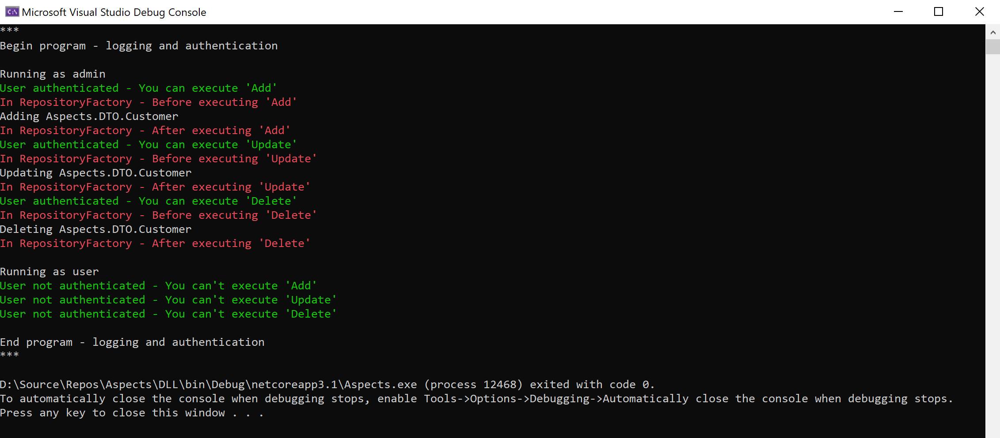

# Aspects Demo

### Aspect Oriented Programming w/ Dynamic Dependancy Injection

---

## Aspect Oriented Programming ([AOP])

* CREATED BY:   [Latency McLaughlin]
* FRAMEWORK:    [.NET] v5.0, & Core v[3.1](https://www.microsoft.com/net/download/windows)
* LANGUAGE:     [C#] (v8.0)
* GFX SUBSYS:   [Console]
* SUPPORTS:     [Visual Studio] 2019, 2017, 2015, 2013, 2012, 2010, 2008
* UPDATED:      10/29/2020
* VERSION:      [1.0.0]
* TAGS:         [.NET], [C#], [AOP], [Parametric Polymorphism]

## Navigation
* <a href="#output">Output</a>
* <a href="#other">Other features</a>
* <a href="#references">References</a>
* <a href="#license">License</a>

<h2><a name="output">Output</a></h2>

### Screenshot

<h2><a name="other">Other Features</a></h2>

- Unit Tests: 
  The unit test uses [NUnit] to help qualify the underlying [API].   Included is a sample that can be ran and tested againsted a variety of mock senario conditions.

<h2><a name="references">References</a></h2>

 [.NET], [IoC], [DI], [Generics], [Delegates], [EventHandlers], [Parametric Polymorphism]

<h2><a name="license">License</a></h2>

[GNU LESSER GENERAL PUBLIC LICENSE] - Version 3, 29 June 2007

[//]: # (These are reference links used in the body of this note and get stripped out when the markdown processor does its job.)

   [GNU LESSER GENERAL PUBLIC LICENSE]: <http://www.gnu.org/licenses/lgpl-3.0.en.html>
   [Comparison]: <https://en.wikipedia.org/wiki/Comparison_of_C_Sharp_and_Java>
   [NuGet]: <https://www.nuget.org/packages/AsyncTask/>
   [.NET]: <https://en.wikipedia.org/wiki/.NET_Framework/>
   [WPF]: <https://en.wikipedia.org/wiki/Windows_Presentation_Foundation/>
   [Visual Studio]: <https://en.wikipedia.org/wiki/Microsoft_Visual_Studio/>
   [Latency McLaughlin]: <https://www.linkedin.com/in/Latency/>
   [API]: <https://en.wikipedia.org/wiki/Application_programming_interface>
   [AOP]: <https://en.wikipedia.org/wiki/Aspect-oriented_programming>
   [Parametric Polymorphism]: <https://en.wikipedia.org/wiki/Parametric_polymorphism>
   [AsyncTask]: <https://github.com/Latency/AsyncTask/>
   [TAP]: <https://msdn.microsoft.com/en-us/library/hh873175(v=vs.110).aspx>
   [AMI]: <https://en.wikipedia.org/wiki/Asynchronous_method_invocation>
   [TPL]: <https://msdn.microsoft.com/en-us/library/dd460717(v=vs.110).aspx>
   [ORM]: <https://en.wikipedia.org/wiki/Object-relational_mapping>
   [C#]: <https://en.wikipedia.org/wiki/C_Sharp_(programming_language)>
   [DLL]: <https://en.wikipedia.org/wiki/Dynamic-link_library>
   [MVC]: <https://en.wikipedia.org/wiki/Model%E2%80%93view%E2%80%93controller>
   [MVA]: <https://en.wikipedia.org/wiki/Model%E2%80%93view%E2%80%93adapter>
   [CMS]: <https://en.wikipedia.org/wiki/Content_management_system>
   [IoC]: <https://msdn.microsoft.com/en-us/library/ff921087.aspx>
   [DI]: <https://en.wikipedia.org/wiki/Dependency_injection>
   [Generics]: <https://en.wikipedia.org/wiki/Generic_programming>
   [Delegates]: <https://msdn.microsoft.com/en-us/library/ms173171.aspx>
   [EventHandlers]: <https://msdn.microsoft.com/en-us/library/2z7x8ys3(v=vs.90).aspx>
   [NUnit]: <https://en.wikipedia.org/wiki/NUnit>
   [lambda expression]: <https://msdn.microsoft.com/en-us/library/bb397687.aspx>